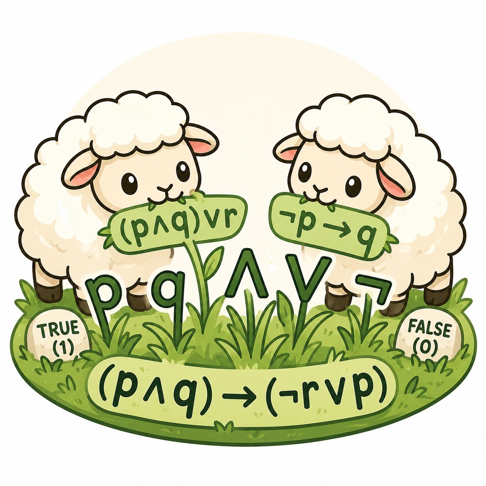

boolean-bestiary
================

``boolean-bestiary`` provides a PettingZoo Parallel environment for n-player Boolean games.

In a Boolean game, each agent controls one or more Boolean variables and has a private Boolean goal formula. Agents act simultaneously and receive rewards based on goal satisfaction minus optional action costs.

Conda Environment
=================

Create the project environment:

.. code-block:: bash

   conda env create -f environment.yml
   conda activate boolean-bestiary

If the environment already exists:

.. code-block:: bash

   conda env update -f environment.yml --prune
   conda activate boolean-bestiary

.. toctree::
   :maxdepth: 2
   :caption: Contents

   environment
   formulas
   examples

References
==========

- Harrenstein, P., van der Hoek, W., Meyer, J.-J. C., and Witteveen, C. (2001). *Boolean Games*. TARK 2001. `PDF <https://www.tark.org/proceedings/tark_jul8_01/p287-harrenstein.pdf>`_
- Harrenstein, P., van der Hoek, W., Meyer, J.-J. C., and Witteveen, C. (2002). *On Modal Logic Interpretations of Games*. ECAI 2002. `Record <https://research-portal.uu.nl/en/publications/on-modal-logic-interpretations-of-games>`_
- Gutierrez, J., Harrenstein, P., and Wooldridge, M. (2015). *Iterated Boolean Games*. *Artificial Intelligence*. `Article <https://www.sciencedirect.com/science/article/pii/S0890540115000267>`_
