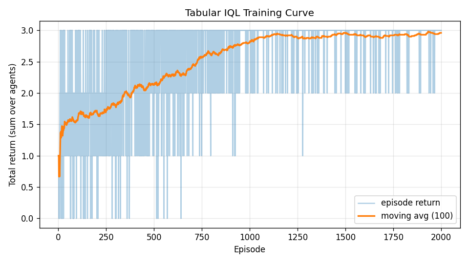

# Examples Report

## Tabular IQL baseline

The `examples/train_iql.py` script trains independent tabular Q-learners (one per agent) on `BooleanGameEnv`.

- Environment: `BooleanGameEnv(num_agents=3, max_cycles=1)`
- Algorithm: Independent Q-Learning (IQL)
- State encoding: global Boolean assignment encoded to an integer index
- Action encoding: per-agent `MultiBinary(k)` action encoded/decoded to tabular action indices
- Exploration: epsilon-greedy with linear decay

Implementation files:

- `examples/algorithms/iql.py`
- `examples/train_iql.py`

## Training outputs

Running:

```bash
python examples/train_iql.py
```

produces:

- `examples/assets/iql_training_returns.csv`
- `examples/assets/iql_training_curve.png`

In a recent run, the final 100-episode mean total return reported by the script was **2.96**.

## Training curve



## Notes

- This baseline is intentionally simple and fully tabular.
- It is useful as a correctness and regression baseline before trying deeper MARL methods.
